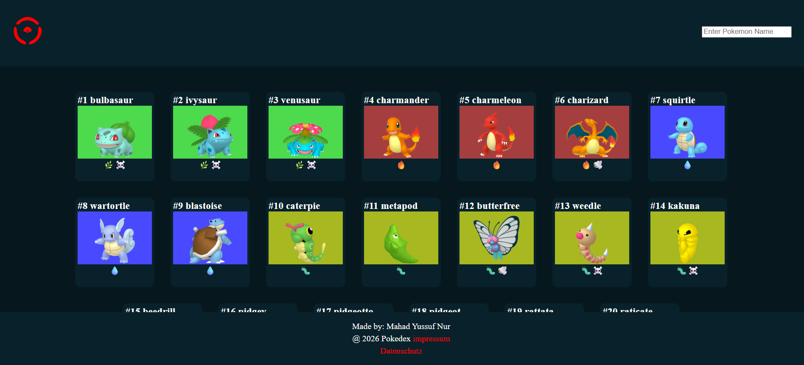

# Pokédex

A modern and responsive Pokédex web application built with HTML, CSS, and JavaScript. The application fetches Pokémon data from the PokéAPI and allows users to browse, search, and view detailed information about their favorite Pokémon.

## Live Demo

https://ootaryare-nur.de/pokedex/

## Features

* Display Pokémon dynamically from the PokéAPI
* Search Pokémon by name
* Detailed Pokémon information in a modal/card view
* Responsive design for desktop and mobile devices
* Dynamic rendering with JavaScript
* Loading states while fetching API data

## Technologies Used

* HTML5
* CSS3
* JavaScript (ES6)
* REST API
* PokéAPI

## API

This project uses the PokéAPI:

https://pokeapi.co/

## Screenshots

### Home Page



## Installation

Clone the repository:

```bash
git clone https://github.com/your-username/pokedex.git
```

Open the project folder and start `index.html` in your browser.

## Project Structure

```text
pokedex/
│
├── index.html
├── style.css
├── script.js
├── assets/
│   ├── images/
│   └── icons/
└── README.md
```

## Learning Goals

This project was created to improve skills in:

* Working with REST APIs
* Asynchronous JavaScript (async/await)
* DOM manipulation
* Dynamic rendering
* Responsive web design
* Clean code structure

## Future Improvements

* Filter Pokémon by type
* Pagination or infinite scrolling
* Favorites system
* Dark mode
* Improved animations
* Performance optimization through caching

## Author

Mahad Nur

Web Development Student

## License

This project is intended for educational purposes.
